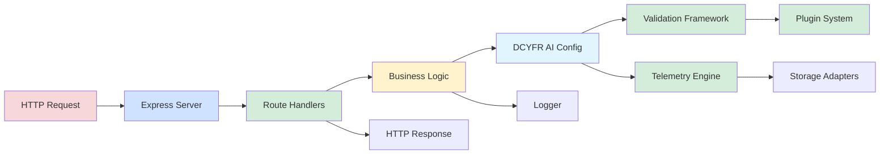

# DCYFR AI Node.js & TypeScript Starter Template

[](https://nodejs.org)
[](https://www.typescriptlang.org/)
[](./LICENSE)
[](./vitest.config.ts)

**A production-ready starter template for building Node.js web servers with TypeScript and DCYFR AI framework.**

This template provides a solid foundation for building modern web applications with integrated AI capabilities, strict TypeScript configuration, comprehensive testing setup, and best practices baked in.

> **Looking for CLI tooling?** See [@dcyfr/ai-cli](../dcyfr-ai-cli) — the standalone command-line interface for the DCYFR AI framework.

## Table of Contents

<details>
<summary>📑 Table of Contents</summary>

- [Features](#-features)
- [Quick Start](#-quick-start)
  - [Prerequisites](#prerequisites)
  - [Installation](#installation)
  - [Development](#development)
- [Project Structure](#-project-structure)
- [Architecture](#-architecture)
- [Usage Examples](#-usage-examples)
  - [Web Server](#web-server)
  - [Basic Framework Usage](#basic-framework-usage)
  - [Custom Plugin](#custom-plugin)
  - [Logging](#logging)
- [Configuration](#️-configuration)
  - [DCYFR AI Configuration](#dcyfr-ai-configuration)
  - [Application Configuration](#application-configuration)
- [Testing](#-testing)
- [Building for Production](#-building-for-production)
- [Customization](#-customization)
- [Troubleshooting](#-troubleshooting)
- [Versioning](#-versioning)
- [Contributing](#-contributing)
- [License & Sponsorship](#-license--sponsorship)

</details>

## ✨ Features

- 🌐 **Express Web Server** - Production-ready HTTP server with middleware
- 🤖 **DCYFR AI Integration** - Built-in AI framework with plugins, validation, and telemetry
- 📘 **TypeScript Strict Mode** - Full type safety with strict compiler options
- ⚡ **Modern Node.js** - ESM modules, Node.js 24+, latest features
- 🧪 **Vitest Testing** - Fast unit testing with coverage reporting
- 🔧 **Developer Experience** - Hot reload, source maps, path aliases
- 📊 **Structured Logging** - JSON-based logging with multiple levels
- 🔌 **Plugin System** - Extensible architecture with custom plugins
- ✅ **Code Quality** - ESLint, Prettier, strict validation
- 📦 **Ready to Deploy** - Production build configuration included

## 🚀 Quick Start

### Prerequisites

- **Node.js** ≥ 24.13.0
- **npm** ≥ 11.6.2

### Installation

```bash
# Clone or use this template
git clone <your-repo-url> my-project
cd my-project

# Install dependencies
npm install

# Start development
npm run dev
```

### Development

```bash
# Web Server
npm run serve           # Start development web server
npm start               # Start production web server

# Development
npm run dev             # Run in watch mode
npm run build           # Build for production
npm test                # Run tests
npm run test:coverage   # Run tests with coverage
npm run type-check      # Type check only
npm run lint            # Lint code
```

## 📁 Project Structure

```
dcyfr-ai-nodejs/
├── src/
│   ├── index.ts              # Main entry point
│   ├── server.ts             # Express web server
│   ├── lib/
│   │   ├── logger.ts         # Structured logging utility
│   │   └── config.ts         # Configuration loader
│   └── types/
│       └── index.ts          # TypeScript type definitions
├── examples/
│   ├── basic-usage.ts        # Basic framework usage
│   ├── plugin-system.ts      # Custom plugin examples
│   └── telemetry.ts          # Advanced telemetry
├── tests/
│   └── unit/
│       ├── logger.test.ts    # Logger tests
│       └── config.test.ts    # Config tests
├── .dcyfr.yaml               # DCYFR AI configuration
├── tsconfig.json             # TypeScript configuration
├── vitest.config.ts          # Test configuration
└── package.json              # Project metadata
```

## 🏗️ Architecture

The template follows a layered architecture with clear separation between HTTP layer, business logic, and AI framework integration:



### Key Components

1. **HTTP Layer** (`src/server.ts`)
   - Express web server with middleware
   - Request routing and validation
   - Response formatting

2. **Business Logic** (`src/index.ts`, `src/lib/`)
   - Application entry point
   - Configuration management
   - Utility functions

3. **DCYFR AI Integration** (`.dcyfr.yaml`)
   - Framework configuration
   - Plugin registration
   - Validation rules
   - Telemetry settings

4. **Plugin System** (`@dcyfr/ai`)
   - Extensible validation plugins
   - Custom tool integration
   - Memory management

5. **Infrastructure** (`src/lib/`)
   - Structured logging (JSON format)
   - Configuration loader
   - Type definitions

[⬆️ Back to top](#dcyfr-ai-nodejs--typescript-starter-template)

---

## 🎯 Usage Examples

### Web Server

Start the Express web server with DCYFR AI integration:

```bash
npm run serve
```

The server will start on `http://localhost:3000` with the following endpoints:

- `GET /health` - Health check endpoint
- `GET /api/status` - Service status and metrics
- `POST /api/validate` - Validation endpoint
- `GET /api/telemetry/stats` - Telemetry statistics

Example request:

```bash
# Health check
curl http://localhost:3000/health

# Validate data
curl -X POST http://localhost:3000/api/validate \
  -H "Content-Type: application/json" \
  -d '{"data": {"email": "user@example.com"}}'
```

### Basic Framework Usage

```typescript
import { ValidationFramework, TelemetryEngine } from '@dcyfr/ai';

const telemetry = new TelemetryEngine({
  enabled: true,
  storage: 'file',
  basePath: '.dcyfr/telemetry'
});

const validation = new ValidationFramework({
  failureMode: 'error',
  parallel: true
});

// Use in your application
const result = await validation.validate({
  projectRoot: process.cwd(),
  files: ['src/**/*.ts']
});

if (result.valid) {
  console.log('Validation passed!');
}
```

### Custom Plugin

```typescript
import type { Plugin } from './src/types';

class MyPlugin implements Plugin {
  name = 'my-plugin';
  version = '1.0.0';
  
  async initialize() {
    console.log('Plugin initialized');
  }
  
  async shutdown() {
    console.log('Plugin shutdown');
  }
}
```

### Structured Logging

```typescript
import { createLogger } from './src/lib/logger';

const logger = createLogger('app');

logger.info('Application started', { 
  version: '1.0.0',
  environment: 'production'
});

logger.error('Operation failed', {
  error: error.message,
  stack: error.stack
});
```

## 🔧 Configuration

### DCYFR AI Configuration (`.dcyfr.yaml`)

```yaml
version: "1.0"
project:
  name: my-project
  type: application

features:
  telemetry: true
  validation: true
  plugins: true

validation:
  rules:
    require-esm: error
    require-strict-types: error
```

### Application Configuration

Create a `config.json` in the project root to override defaults:

```json
{
  "telemetry": {
    "enabled": true,
    "level": "debug"
  },
  "validation": {
    "enabled": true,
    "strict": true
  },
  "server": {
    "port": 8080,
    "host": "0.0.0.0"
  }
}
```

## 🧪 Testing

The template includes comprehensive testing setup with Vitest:

```bash
# Run all tests
npm test

# Run tests in watch mode
npm run test:watch

# Generate coverage report
npm run test:coverage
```

Coverage thresholds are configured at 80% for lines, functions, and statements.

## 📦 Building for Production

```bash
# Clean previous builds
npm run clean

# Build TypeScript to JavaScript
npm run build

# Start production server
npm start
```

The build outputs to the `dist/` directory with:
- Compiled JavaScript (ES2022)
- Type declarations (.d.ts)
- Source maps

## 🛠️ Customization

### Adding New Features

1. Create feature files in `src/`
2. Add types to `src/types/`
3. Write tests in `tests/unit/`
4. Update exports in `src/index.ts`

### Creating Plugins

1. Implement the `Plugin` interface
2. Add plugin configuration to `.dcyfr.yaml`
3. Initialize in your application code

### Path Aliases

TypeScript path aliases are configured:

```typescript
import { logger } from '@/lib/logger';      // src/lib/logger.ts
import { MyTest } from '@tests/helpers';    // tests/helpers.ts
```

## 📚 Documentation

- **Getting Started**: [GETTING_STARTED.md](./GETTING_STARTED.md)
- **Contributing**: [CONTRIBUTING.md](./CONTRIBUTING.md)
- **DCYFR AI Docs**: [@dcyfr/ai documentation](../dcyfr-ai/README.md)

[⬆️ Back to top](#dcyfr-ai-nodejs--typescript-starter-template)

---

## 🔧 Troubleshooting

### Path Alias Resolution Issues

**Issue: Import using `@/` path alias fails with "Cannot find module"**
- **Cause:** TypeScript path aliases not configured for runtime or tooling
- **Solution:**
  1. Verify `tsconfig.json` has paths configured:
     ```json
     "paths": {
       "@/*": ["./src/*"],
       "@tests/*": ["./tests/*"]
     }
     ```
  2. For Vitest: Ensure `vitest.config.ts` includes resolver
  3. For Node runtime: Use `tsx` or `ts-node` with `tsconfig-paths` registered
  4. For build output: Path aliases are resolved during compilation
- **Verify:** Run `npm run typecheck` to validate TypeScript configuration

**Issue: Path alias works in IDE but fails in tests**
- **Cause:** Test runner doesn't recognize TypeScript paths
- **Solution:**
  1. Check `vitest.config.ts` has `resolve.alias` configured
  2. Restart VS Code TypeScript server: `Cmd+Shift+P` → "Restart TS Server"
  3. Clear vitest cache: `rm -rf node_modules/.vitest`
- **Alternative:** Use relative imports in test files

### DCYFR AI Configuration Errors

**Issue: `.dcyfr.yaml` not loading or validation fails**
- **Cause:** Invalid YAML syntax or missing required fields
- **Solution:**
  1. Validate YAML syntax: `npx @dcyfr/ai config:validate`
  2. Check required fields: `version`, `projectName` must be present
  3. Verify indentation (use spaces, not tabs)
  4. Check quotes around string values with special characters
- **Example minimal config:**
  ```yaml
  version: '1.0.0'
  projectName: my-app
  ```
- **Debug:** Run with verbose flag: `npx @dcyfr/ai config:validate --verbose`

**Issue: Environment variables not overriding config**
- **Cause:** Incorrect variable naming or not loaded before app starts
- **Solution:**
  1. Use correct format: `DCYFR_SECTION_KEY` (e.g., `DCYFR_TELEMETRY_ENABLED=false`)
  2. Load env vars before importing DCYFR: `import 'dotenv/config'` at top of entry
  3. Verify precedence: env vars > `.dcyfr.yaml` > framework defaults
- **Verify:** Log config to see final merged values: `console.log(await loadConfig())`

### Build and Production Deployment Issues

**Issue: Build fails with TypeScript errors**
- **Cause:** Strict mode catches type errors not visible in development
- **Solution:**
  1. Run `npm run typecheck` to see all errors
  2. Fix type issues incrementally (start with `src/index.ts`)
  3. Consider temporarily disabling strict checks: `"strict": false` in tsconfig
  4. Ensure all dependencies have type definitions: `npm install --save-dev @types/express`
- **Best practice:** Run typecheck in pre-commit hook to catch errors early

**Issue: Production server crashes with "Cannot find module"**
- **Cause:** Missing dependencies or incorrect import paths after build
- **Solution:**
  1. Verify all dependencies in `package.json` (not devDependencies)
  2. Check `dist/` output has all necessary files
  3. Ensure path aliases resolved during build: `tsc --showConfig`
  4. Test production build locally: `npm run build && npm start`
- **Common mistake:** Importing from `devDependencies` in production code

**Issue: Performance degradation in production**
- **Cause:** Development tools still enabled or logging too verbose
- **Solution:**
  1. Set `NODE_ENV=production` environment variable
  2. Reduce log level: `LOG_LEVEL=info` (not `debug`)
  3. Disable telemetry if not needed: `DCYFR_TELEMETRY_ENABLED=false`
  4. Enable compression: Add `compression` middleware to Express
- **Monitor:** Use `console.time()` to identify slow operations

### Server and API Issues

**Issue: Server fails to start on specified port**
- **Cause:** Port already in use or insufficient permissions
- **Solution:**
  1. Check if port in use: `lsof -i :3000` (or `netstat -ano | findstr :3000` on Windows)
  2. Kill existing process or change port: `PORT=3001 npm start`
  3. Use port ≥1024 to avoid needing root permissions
  4. Check firewall settings if remote access needed
- **Best practice:** Use `PORT` environment variable for deployment flexibility

**Issue: API endpoints return 404 in production**
- **Cause:** Routes not properly registered or build output issue
- **Solution:**
  1. Verify route registration in `src/server.ts`
  2. Check `dist/` contains all route handler files
  3. Enable Express router debugging: `DEBUG=express:* npm start`
  4. Test endpoints individually: `curl -v http://localhost:3000/health`
- **Debug:** Add logging to route handlers to confirm they're executing

[⬆️ Back to top](#dcyfr-ai-nodejs--typescript-starter-template)

---

## 📦 Versioning

This package uses [Changesets](https://github.com/changesets/changesets) for automated versioning and releases.

### For Contributors

When making changes that affect the public API or user experience:

```bash
npm run changeset
```

This will prompt you to:
1. Select the type of change (patch, minor, major)
2. Provide a brief summary

The changeset will be committed with your code changes. When merged to `main`, an automated "Version Packages" PR will be created.

### Installing Specific Versions

```bash
# Latest version
npm install @dcyfr/ai-nodejs-starter

# Specific version
npm install @dcyfr/ai-nodejs-starter@1.2.3
```

## 🤝 Contributing

Contributions are welcome! Please read [CONTRIBUTING.md](./CONTRIBUTING.md) for guidelines.

## 📄 License & Sponsorship

**License:** MIT for personal/non-commercial use. Commercial use requires a paid tier.

This template is dual-licensed:
- **MIT License** for personal, educational, and non-commercial use (free)
- **Commercial License** for business and revenue-generating use (paid tiers)

**Sponsorship Tiers:**
- 🌍 **Community** ($5/mo) - Signal community access (DCYFR.NET, Quantum Flux)
- 💚 **Sponsors** ($10/mo) - Bio on website + private channels
- 👨‍💻 **Developer** ($20/mo) - Limited commercial license + pre-release + portfolio support
- 🚀 **Founder** ($2,400/yr) - Full commercial license + 1hr consultation/mo
- 🏢 **Enterprise** ($9,600/yr) - Enterprise license + premium support

**Learn more:** [SPONSORSHIP.md](../SPONSORSHIP.md) | **Contact:** licensing@dcyfr.ai
**Trademark:** "DCYFR" is a trademark of DCYFR Labs. See [TRADEMARK.md](../TRADEMARK.md)

## 🔗 Related Projects

- [@dcyfr/ai](../dcyfr-ai) - Core DCYFR AI framework
- [@dcyfr/agents](../dcyfr-agents) - DCYFR validation agents
- [dcyfr-labs](../dcyfr-labs) - Reference implementation

## 💬 Support

- **Issues**: [GitHub Issues](https://github.com/dcyfr/dcyfr-ai-nodejs/issues)
- **Discussions**: [GitHub Discussions](https://github.com/dcyfr/dcyfr-ai-nodejs/discussions)
- **Documentation**: [DCYFR AI Docs](https://github.com/dcyfr/dcyfr-ai)

---

**Built with ❤️ by DCYFR** | [Website](https://dcyfr.ai) | [GitHub](https://github.com/dcyfr)
